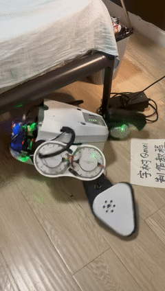
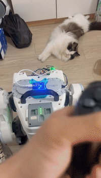

# 双足机器人强化学习平衡控制

> 本科毕业论文项目 · 基于 RoboTamer4Qmini


[](https://developer.nvidia.com/isaac-gym)
[](https://arxiv.org/abs/1707.06347)
[](https://opensource.org/licenses/MIT)

## 项目简介

本项目是我的本科毕业论文《基于动态姿态约束奖励优化的双足机器人强化学习平衡控制研究》的代码实现。

项目以 **Unitree Qmini 双足机器人**为对象，基于 **NVIDIA Isaac Gym** 与 **PPO** 深度强化学习，在官方 **RoboTamer4Qmini** 策略基础上进行改进：引入"随运动状态变化的参考姿态"（动态参考姿态奖励），使平衡奖励不再机械地要求躯干始终竖直，而是根据运动状态动态生成目标姿态，从而提升机器人的平衡能力与抗扰动能力，并通过仿真与真机推扰实验进行验证。

## 核心工作

- **动态参考姿态奖励**：将平衡奖励中固定的参考姿态（`roll_ref = 0`、`pitch_ref = 0`）改为随运动状态动态生成：
  - `roll_ref = f(横向速度, 横滚角速度)`
  - `pitch_ref = f(前向速度误差, 俯仰角速度)`

  向前加速时允许适当俯身，横向运动或受到侧向扰动时允许适当侧倾，扰动结束后参考姿态逐渐回归中性。
- **训练稳定性保护**：修复随机种子传递、终止后旧观测泄漏、重置时观测历史清理、单环境 NaN/Inf 检测与隔离、Critic 输入限幅等问题。
- **仿真与真机实验**：统一"1.0 m/s 推扰、10 秒、第 4 秒推扰"的测试配置，设置 A0（官方基线）、A′（公平续训基线）、B（动态参考姿态）三组对照，统计存活时间、姿态 RMSE、最大倾角、恢复时间等指标。

## 后续计划

- [ ] 优化奖励函数
- [ ] 新增"自己起身"强化学习任务
- [ ] 新增"踢球"强化学习任务
- [ ] 增加更多强化学习任务

## 真机部署记录

第一次部署官方训练的策略，机器人跌跌撞撞、边调整边摸索中……

<table>
  <tr>
    <td align="center"></td>
    <td align="center"></td>
  </tr>
</table>

## 代码结构

   ```
RoboTamer4Qmini/
   ├── assets/                 # 机器人的 URDF 模型
   ├── config/                 # 配置文件（含 BIRL 系列姿态奖励配置）
   ├── env/                    # 仿真环境与任务
   ├── experiments/            # 训练模型与评测结果
   ├── model/                  # 神经网络结构
   ├── utils/                  # 工具函数
   ├── train.py                # 训练模型
   ├── play.py                 # 评测预训练模型
   ├── export_pt2onnx.py       # 导出 *.pt 为 *.onnx
   ├── evaluate_baseline.py    # 推扰等基准测试
   ├── summarize_evaluation.py # 汇总评测结果
   ├── tune_pid.py             # 优化 PID 参数（缩小仿真与真机差异）
   ├── tune_urdf.py            # 加载并查看 URDF
   ├── requirements.txt        # 依赖
   └── README.md
   ```

### 注意事项

* 在 `play.py`、`train.py`、`Base.py`、`tune_urdf.py`、`tune_pid.py` 中存在一些硬编码路径，请按自己的环境修改。
* 项目需安装成功后才能运行。

## 安装

### 环境要求

- Ubuntu 18.04 或 20.04
- NVIDIA 驱动 470+
- NVIDIA Pascal 或更新的 GPU，显存至少 8 GB
- CUDA 11.4+
- Python 3.8+
- PyTorch 2.0.0+
- Isaac Gym 1.0rc3+
- 其他依赖见 `requirements.txt`

### 步骤

1. 创建 conda 环境：

```bash
$ conda create -n isaac python==3.8 && conda activate isaac
```

2. 安装依赖：

```bash
pip3 install torch==2.0.0 torchvision==0.15.1 torchaudio==2.0.0
tar -zxvf IsaacGym_Preview_3_Package.tar.gz && cd ./isaacgym/python && pip install -e .
pip3 install -r requirements.txt
pip3 install matplotlib pandas tensorboard opencv-python numpy==1.23.5 openpyxl onnxruntime onnx
```

## 使用说明

### 训练

```bash
$ python train.py --config BIRL --name <name>
```

常用参数：

  - `--config <str>`：配置文件（`BIRL` 官方奖励、`BIRLBaseline` 静态姿态、`BIRLDynamicReference` 动态参考姿态等）
  - `--name <str>`：实验名称
  - `--resume <str>`：从检查点恢复训练
  - `--num_envs <int>`：并行环境数
  - `--seed <int>`：随机种子
  - `--max_iterations <int>`：最大迭代次数
  - `--rl_device <str>`：RL 设备（默认 `cuda:0`）

### 可视化日志

```bash
$ tensorboard --logdir experiments/
```

### 评测

```bash
$ python play.py --render --name <name>
```

  - `--time <float>`：评测时长（秒）
  - `--video`：录制视频
  - `--debug`：保存数据到 Excel
  - `--cmp_real`：与真机数据对比绘图

### 导出 ONNX

```bash
$ python export_pt2onnx.py --name <name>
```

### 其他工具

```bash
$ python tune_urdf.py          # 加载并查看 URDF
$ python tune_pid.py           # 优化 PID 参数
$ python evaluate_baseline.py  # 推扰等基准测试
```

## 许可证

本项目基于 MIT 协议开源的 RoboTamer4Qmini 开发，同样采用 MIT 许可证。
